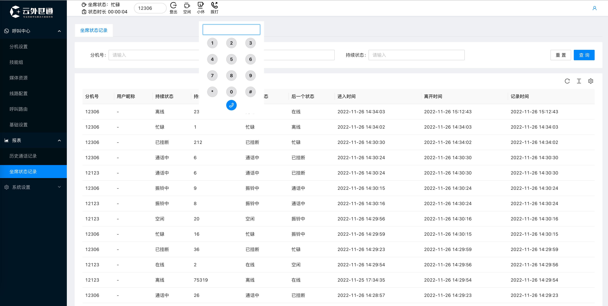

# YWCC —— 开箱即用的软交换话务中心平台

### 平台简介

> 一键部署，开箱即用，易集成

YWCC是一款基于FreeSWITCH开源软交换平台开发，拥有基本的分机、技能组、线路、IVR流程路由管理的基本话务能力，拥有话务话单记录，坐席状态变更记录，通话录音等能力。同时也开放了独立的话务条SDK，可以将话务条集成至企业自己的CRM等系统中。


### 功能点
1. 分机管理
2. 技能组设置
3. 媒体资源
4. 线路配置
5. 呼叫路由
6. TTS(已集成百度、阿里平台)
7. 支持WebRTC
8. 历史通话记录
9. 坐席状态记录
10. 通话录音
11. 独立电话条SDK支持


### 演示环境
**大家观看时请勿随意修改演示账号密码！！！谢谢**

演示地址：[https://demo.cdxxzz.com](https://demo.cdxxzz.com)

默认账号: admin/654321

### 环境部署

#### 开发语言
+ Go
+ React

#### 组件模块
+ FreeSWITCH
+ Mysql
+ Redis
+ Nginx

#### 安装部署
CentOS7.x系统
```
# 安装docker
yum install -y curl
curl -fsSL https://get.docker.com | bash -s docker --mirror Aliyun

# 若上述指令无法使用，试试这个
curl -sSL https://get.daocloud.io/docker | sh

# 将deploy目录docker-compose.yml放置操作系统 /opt/cc目录下直接拉起服务即可
# 修改yml文件中EXTERNAL_IP_V4的值为自己公网地址，若内网使用则修改为内网地址，freeswitch rtp端口默认开放较少可自行修改扩大端口范围
docker compose -d up
```


### 演示系统



### 联系我们

